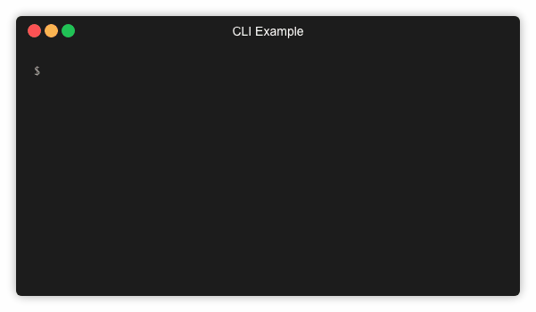

# Gluegun Starter - CLI

A CLI Starter for your next [Gluegun](https://infinitered.github.io/gluegun/#/) CLI project.



[](/LICENSE) [](https://circleci.com/gh/TheoryLabs/GluegunStarter/tree/master)
[](https://david-dm.org/TheoryLabs/GluegunStarter) [](https://david-dm.org/TheoryLabs/GluegunStarter?type=dev)

[](https://github.com/TheoryLabs/GluegunStarter/fork) [](https://github.com/TheoryLabs/GluegunStarter)

## Initialize CLI


<!--
Via lenne.Tech CLI:
-->

<!--
```shell
$ npm install -g @lenne.tech/cli
$ lt cli create <CLI_NAME>
```
-->

### Via GitHub

```shell
    git clone https://github.com/TheoryLabs/GluegunStarter.git <CLI_NAME>
    cd <CLI_NAME>
    npm i
    npm run rename <CLI_NAME>
```

### Via ZIP File

1. Download Starter: https://github.com/TheoryLabs/GluegunStarter/archive/main.zip
2. Unpack ZIP
3. Run `npm i && npm run rename <CLI_NAME>` in project directory


<!--
## Customizing your CLI

Check out the documentation at https://github.com/infinitered/gluegun/tree/master/docs.

## Publishing to NPM

To package your CLI up for NPM, do this:

```shell
$ npm login
$ npm whoami
$ npm lint
$ npm test
(if typescript, run `npm run build` here)
$ npm publish
(if you are publish a plublic package for the first time: npm publish --access public)
```

# License

MIT - see LICENSE
-->